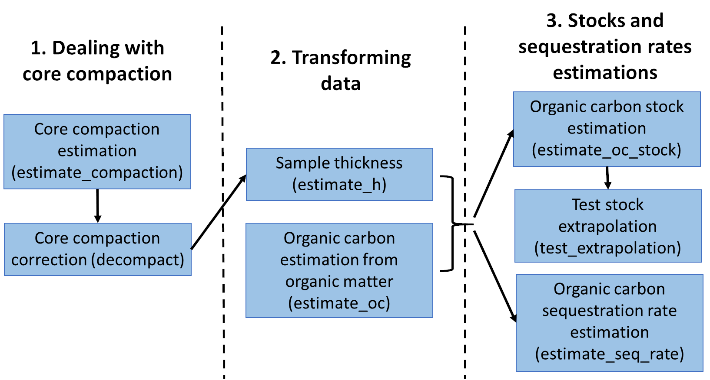

Correspondence:

Nerea Piñeiro-Juncal, University of Vigo, Vigo, Spain. Email: [np.juncal\@gmail.com](mailto:np.juncal@gmail.com){.email}

# Summary

Need for this: blue carbon papapapa.... many sources...

*BlueCarbon* facilitate the estimation of organic carbon stocks and sequestration rates from soil/sediment cores from blue carbon ecosystems. It contains seven main functions to estimate the compaction of cores, mathematically correct core compaction, estimate sample thickness, estimate organic carbon content from organic matter content, estimate organic carbon stocks and sequestration rates and visualize the error of stock extrapolation.

*Keywords*: R package, coastal wetlands, carbon stocks, sequestration rates, reproducibility

```{r setup, include=FALSE, cache=FALSE, message = FALSE}
library("knitr")
### Chunk options: see http://yihui.name/knitr/options/ ###
## Text results
opts_chunk$set(echo = TRUE, warning = TRUE, message = FALSE, out.width = "100%")
## Code decoration
opts_chunk$set(tidy = TRUE, comment = NA, highlight = TRUE)
## Cache
opts_chunk$set(cache = TRUE, cache.path = "output/cache/")
## Plots
opts_chunk$set(fig.path = "output/figures/", dpi = 300)
```

# Statement of Need

Coastal blue carbon ecosystems have earn a large attention for their role as sinks of organic carbon. In the last decade, publications about blue carbon research have grown exponentially, including many studies reporting soil organic carbon stocks and sequestration rates (). Although there are many soil sampling estrategies, estimation methodologies are fairly homogeneous, following the protocol published by the Blue Carbon initiative (). However, and although many blue carbon researchers work in R and it is becoming more comon to publish the code used, there is no R library with functions especifically for blue carbon estimations. This library aims to standardize and automate the main estimations to get soil/sediment blue carbon stocks and sequestration rates from raw field and laboratory data.

# Desing

The BLueCarbon library is composed of 7 main functions.

1.  estimate_compaction

2.  decompact

3.  estimate_oc

4.  estimate_h

5.  estimate_oc_stocks

6.  test_extrapolation

7.  estimate_seq_rate

{width="532"}

#### ***estimate_compaction*** **- Estimate Core Compaction**

Sampling soil cores by manual percussion usually leads to the compaction of the material retrieved. This function will estimate the percentage of compaction from measurements taken in the field after inserting the corer tube and before extracting it: length of the corer tube, distance between the surface of the soil and the top of the tube in the outside and distance between the surface of the soil and the top of the tube in the inside of the tube.

#### ***decompact*** **- Calculate sediment properties after decompaction**

Core compaction derived from field extraction can be mathematically correct to estimate the original depth of the samples. This function will apply a linear correction (all the core material is assumed to have been compacted equally) to correct sample depth and, if provided, dry bulk density.

#### ***estimate_oc*** **- Organic carbon content estimation from organic carbon data**

There is linear correlation between organic carbon and organic matter content. This correlation can change between ecosystems and sampling sites due to changes in organic matter composition among other factors. This function model a linear correlation between organic matter and organic carbon content in your samples and predict the content of organic carbon for those samples were there is no organic carbon values. Estimation of organic carbon is done by means of linear regressions on log(organic carbon) \~ log(organic matter). It gives back a organic carbon value for each organic matter value provided. If there is a organic carbon value for that sample it return the same value, else, generates a model for that site, else, model for specie, else, model for that ecosystem. If a model can not be created due to the low number of samples (\<10) it uses the equations in Fourqurean et al. 2012 for seagrasses, Maxwell et al. 2023 for salt marshes and Piñeiro-Juncal in prepp for mangroves to estimate the organic carbon. It is unlikely, but possible, that a model will predict a higher organic carbon than organic matter content. This is not possible in nature. If this is the case the function will give a warning and it is recommended to discard that model.

Fourqureanet al. (2012) Seagrass ecosystems as a globally significant carbon stock. Nat. Geosci.5, 505–509. <https://doi.org/10.1038/ngeo1477>

Maxwell et al. (2023) Global dataset of soil organic carbon in tidal marshes.Sci.Data 10, 1–14.<https://doi.org/10.1038/s41597-023-02633-x>

Piñeiro-Juncal et al. (in prepp) Soil organic carbon preservation and decay trends in tidal marsh, mangrove and seagrass blue carbon ecosystems.

#### ***estimate_h*** **- Sample thickness estimation**

For those cores were only selected samples were measured it is necessary to assign a carbon density to the empty spaces before the estimation the total stock. This function checks for gaps between samples and, if any, divide this space between the previous and next sample to return sample thickness without gaps in the core. The stock and sequestration rate estimation functions (estimate_oc_stock and estimate_seq_rate) have this function incorporated and it is not necessary to run it beforehand.

#### ***estimate_oc_stock*** **- Organic carbon stock estimation**

Estimates carbon stocks from soil core data down to a specified depth, 100 cm by default. If the core does not reach the desired depth, it extrapolates the stock from a linear model between accumulated mass of organic carbon and depth.

#### ***test_extrapolation*** **- Visualize the error of stock extrapolation**

This function subset those cores that reach the desired depth, estimates the stock (observed stock), estimate the stock from the linear relation of organic carbon accumulated mass and depth using the 90, 75, 50 and 25% top length of the indicated desired depth. Compares the observed stock with the estimated stocks by extrapolation. This function requires that some of you core do reach the desired depth.

#### ***estimate_seq_rate*** **- Organic carbon sequestration rates estimation**

Estimate the average organic carbon sequestration rate to the soil in a indicated time frame (by default last 100 years) from the organic carbon concentration and the age of the samples.

# Availability

The library is available xxxx. [Browse the source core](https://github.com/EcologyR/BlueCarbon/)

[Library and tutorials](https://ecologyr.github.io/BlueCarbon/)


# Key References

# Acknowledgements

The development of this software has been funded by Fondo Europeo de Desarrollo Regional (FEDER) and Consejería de Transformación Económica, Industria, Conocimiento y Universidades of Junta de Andalucía (proyecto US-1381388 led by Francisco Rodríguez Sánchez, Universidad de Sevilla). NPJ was supported by a Juan de la Cierva fellowship (JDC2022-048342-I). JA acknowledges funding from the CLIMB-FOREST Horizon Europe Project (No 101059888) that was funded by the European Union.


